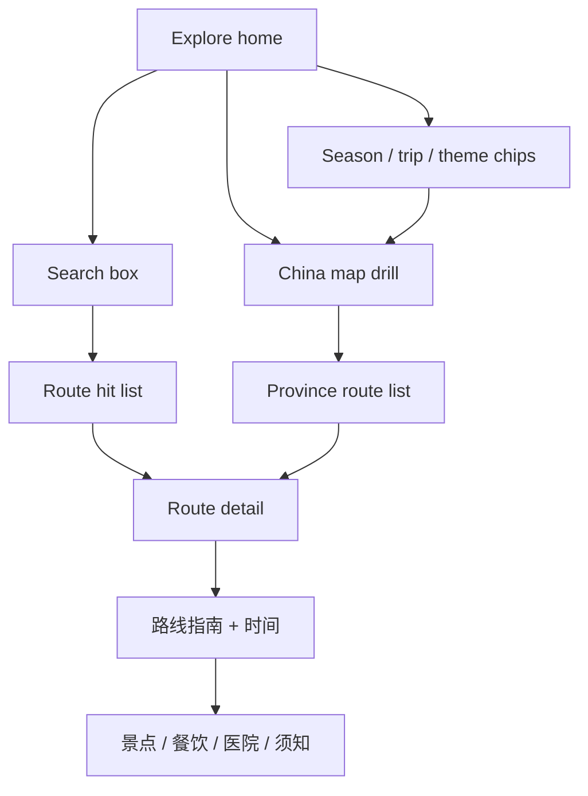

# Mobile UX framework proposal — 适老 travel atlas

**Date:** 2026-08-02  
**Stack:** Next.js App Router (static export + GitHub Pages `basePath`) · Tailwind CSS 4 · React 19  
**Audience:** ~60-year-old parents, Beijing home base · large taps · readable type · Explore = filters + map + **search** · route detail = practical guides

---

## 1. Audit — current mobile pain

### Explore (`ChinaMapExplorer` + home)

| Area | Observation | Pain for 适老 |
|------|-------------|---------------|
| **Hierarchy** | Home hides brand/hero on phone; first paint = filter chips + map. Functional but feels like a scaffold, not a composed product. | Weak brand + weak “what do I do?” signal |
| **Density** | Season + tripType always on; 名景/长居/走廊 under「更多快捷」`<details>` on mobile | Theme chips (high-intent) are buried; parents who know “婺源” must dig |
| **Navigation** | Map drill 全国→大区→省→路线 is solid; sticky 返回 works | Three taps before a route if they already know the name |
| **Map + list** | Map then province buttons then route cards with mini-maps | Province map tap targets OK; route cards are tall/heavy scroll |
| **Typography** | Root `html { font-size: 18px }` + Noto Sans/Serif — good base | Chip labels shrink to `text-base` on phone; hierarchy is sky-* utility soup |
| **Search (pre-fix)** | No keyword entry | Famous places require map geography knowledge |

### Route detail (`app/routes/[id]/page.tsx`)

| Area | Observation | Pain |
|------|-------------|------|
| **Hierarchy** | Long vertical stack: title → summary → budget → tags → map → cover → 介绍 → 指南 → 时间 → 季节 → 照片 → 站点 → 餐饮 → 长居 → 医院 → 须知 → 交通 → 预算… | No in-page TOC / sticky section jump; dense text walls |
| **Progressive disclosure** | Almost everything expanded | Cognitive overload; parents need “先看怎么走 / 再看细节” |
| **Images** | Cover after map; gallery mid-page; stop images in timeline | Hero not full-bleed; map-before-photo is utilitarian but cold |
| **Nav** | Top Header + text「← 返回探索」 | No bottom bar; long page = hard to jump sections or leave |

**Verdict:** Interaction model (map drill + filters) is correct for discovery; presentation is still “working scaffold.” Biggest gap was **intent search** (now shipped) + **detail IA** (section rail / sheet) + **visual system tokens**.

---

## 2. Recommended approach (keep React/Next + Tailwind)

### Core recommendation

**Stay on Tailwind + thin headless primitives.** Do **not** adopt a dashboard kit or Flutter rewrite.

| Layer | Choice | Why |
|-------|--------|-----|
| Styling | **Tailwind 4** + CSS variables in `globals.css` | Already shipping; static export friendly |
| Type scale | Tokenized `--text-body` / `--text-title` / `--tap-min` | Consistency without a component library |
| Overlays | **vaul** (drawer) *or* keep custom dialog (already in `RouteMapWithExpand`) | Bottom sheet for filters / section jump on phone |
| Accessible primitives | **Radix** Dialog/Tabs *optional* later | Only if custom a11y gets costly; Headless UI also OK |
| Carousel | **embla-carousel-react** *optional* P2 | Gallery / stop photos swipe |
| Nav pattern | Sticky top toolbar (exists) + **optional bottom tab bar** (探索 / 两年 / 说明) | Thumb reach; Header can slim on mobile |

### Libraries — fitness for 适老 + static export

| Library | Fit | Notes |
|---------|-----|-------|
| **vaul** | Strong | Bottom sheets: filter sheet, “本页目录”, map expand | CSS-only enough for v1 |
| **Radix UI** | Medium | Dialog/Tabs if we need focus trap without reinventing |
| **Headless UI** | Medium | Same niche as Radix; pick one if needed |
| **embla** | Medium | Photo gallery; keep optional |
| shadcn / dashboard kits | **Avoid** | Card-heavy, purple defaults, wrong density |
| MUI / Ant Design Mobile | **Avoid** | Heavy CSS runtime + aesthetic fight |
| Flutter / RN rewrite | **Avoid** | Wrong cost for static atlas |

### Aesthetic direction (anti-slop)

- Keep **sky / emerald / amber** travel map language already in use — refine tokens, don’t purple-wash.
- Stronger **display serif** for titles; body remains Noto Sans SC.
- Soft paper/sky gradient background stays; reduce ring/card chrome where not interactive.
- One composition on Explore first viewport: **search → primary chips → map**.

---

## 3. Mobile information architecture

### 3.1 Home / Explore

```
┌─────────────────────────────────────┐
│ Brand (compact) · 探索 | 两年 | 说明 │  ← or bottom tabs later
├─────────────────────────────────────┤
│ [🔍 搜索城市、景点或路线     ][清除] │  ← CORE: always on
├─────────────────────────────────────┤
│ IF searching:                       │
│   sticky ← 返回 · 「关键词」· N 条  │
│   list of matching routes           │
│   empty: 没有找到…                  │
├─────────────────────────────────────┤
│ ELSE:                               │
│   季节 chips · 长短 chips           │
│   快捷: 从北京短途 | 当季 | 名景 |  │
│         长居 | 走廊 | …（可见，勿埋）│
│   地图点大区 → 省 → 路线卡片        │
└─────────────────────────────────────┘
```

**Two parallel entry paths (both first-class):**

1. **Search** — “我知道去哪儿” → typed keywords → route list → detail  
2. **Map + filters** — “我想逛逛” → season/trip/theme → 大区→省→路线  

Theme chips (名景 / 长居 / 走廊) are **shortcuts into curated lists**, not a substitute for search.

### 3.2 Route detail

```
┌─────────────────────────────────────┐
│ ← 探索 · 路线标题（sticky compact） │
├─────────────────────────────────────┤
│ Hero photo (edge-to-edge on mobile) │
│ Title · days · budget · key badges  │
│ [看地图] [高德导航]                 │
├─────────────────────────────────────┤
│ Sticky section rail (horizontal):   │
│ 怎么走 | 时间 | 景点 | 吃住 | 就医 | 须知 │
├─────────────────────────────────────┤
│ Default open: 路线指南 + 时间规划   │
│ Rest: collapsed <details> or jump   │
│ Stop timeline under 景点            │
│ Gallery swipe / grid under 景点     │
└─────────────────────────────────────┘
```

Mermaid (IA flow):



---

## 4. Search (shipped / core IA)

**Behavior**

- Large `type="search"` on Explore; placeholder「搜索城市、景点或路线」; min-height ~52px.
- Client-side over `routes` from `@/content` (merged catalog — no content-agent coupling).
- Fields: title, summary, id, region/province names, stop names/summaries/tips, theme labels + ids, seasons, trip type, researchKeywords, fromHome cues.
- Debounce ~180ms; title matches ranked higher.
- Active search replaces map/filters with scannable list; **清除** / **返回** exit search.
- Empty:「没有找到「…」相关路线。」
- Links use Next `Link` → works with GitHub Pages `basePath`.

**Files:** `lib/route-search.ts`, `components/ChinaMapExplorer.tsx`

---

## 5. Priority phases

### P0 — ship now / next sprint

1. **Search box + catalog filter** (done)
2. **Dual-column place-image route cards** for province / theme / search picks (done)
3. Surface **名景 / 长居 / 走廊** on mobile without burying in「更多快捷」only (promote top 3 themes beside 从北京短途)
4. Route detail: **sticky horizontal section jump** (anchors) — pure CSS/`scroll-mt`, no new deps
5. Token pass: `--tap-min: 48px`, clearer title/body steps in `globals.css`

### P1

1. Detail progressive disclosure: default-expand 路线指南 + 时间规划; collapse 参考来源 / 快览说明
2. Mobile bottom nav (探索 / 两年 / 说明) with safe-area padding
3. Explore first viewport: one composition — search + chips + map; kill redundant mobile-hidden hero duplication
4. Optional **vaul** sheet for “筛选” if chip row grows further

### P2

1. Embla gallery on detail
2. Radix Tabs only if section rail needs keyboard a11y beyond anchors
3. Offline search index prebuild if catalog ≫ current size
4. Light motion (map select, sheet open) — 2–3 intentional transitions

---

## 6. What NOT to adopt

- Full **dashboard / admin UI kits** (shadcn mega kits, Ant Design Pro)
- **Purple / glow / glassmorphism** AI-default look
- **Flutter / React Native** rewrite for a static GH Pages atlas
- **Sidebar + hidden search** patterns (bad for 适老)
- Replacing map drill with search-only (parents also browse by region)
- Fighting content agents on `content/*` for UI work
- Heavy runtime CSS-in-JS that fights static export

---

## 7. Top 5 UX changes (executive)

1. **Keyword search on Explore** — bypass map when intent is known  
2. **Dual-column place-image route cards** (小红书-style pick grids)  
3. **Promote theme chips** (名景/长居/走廊) to always-visible mobile row  
4. **Detail section rail** — jump to 怎么走 / 时间 / 景点 / 就医 without endless scroll  
5. **Progressive disclosure + tokens / bottom nav** — practical guide first; thumb-friendly chrome  

---

## 7b. Dual-column route pick cards (Pinterest / 小红书) — shipped

**Where it applies**

- Province → 选路线 grid  
- Theme lists（名景 / 长居 / 走廊 / 大环线 / 边陲）  
- Search result hits  

**Not** province picker buttons or the China map itself.

**Layout:** `grid-cols-2` mobile · `md:grid-cols-3` · alternating taller tiles (`aspect-[3/4]` vs `[4/5]`) for a light masonry feel without a masonry library.

**Card anatomy**

- Full-bleed place photo (`object-cover`)  
- Sky-ink gradient scrim (not purple glass)  
- Overlay: title · days · 大致金额 · optional 从北京 / theme chip  
- Entire card is one `<Link>` (min ~200px tall, large type)

**Image source rule** (`cardImageForRoute` in `lib/place-images.ts`)

1. Place-resolved route cover (`placeCoverForRoute` / `withPlaceImages`)  
2. Else first stop place image  
3. Else China `PLACE_IMAGE_FALLBACK`  

No Xiaohongshu API — catalog images only.

**Components:** `RouteCard` + `RouteCardGrid` in `components/RouteCard.tsx`

---

## 8. Wireframe ASCII — Explore (phone)

```
╔══════════════════════════╗
║ 爸妈中国旅游地图  探索… ║
╠══════════════════════════╣
║ 🔍 搜索城市、景点或路线  ║
║                          ║
║ 季节 全部 春 夏 秋 冬    ║
║ 长短 全部 短途 长线      ║
║ 名景  长居  走廊  短途…  ║
║                          ║
║     【 中国地图 SVG 】   ║
║      点大区继续          ║
╠══════════════════════════╣
║ (选路线 / 搜索 / 主题)   ║
║ ┌──────┐ ┌──────┐        ║
║ │ 图+字│ │ 图+字│  2列  ║
║ └──────┘ └──────┘        ║
╚══════════════════════════╝
```

---

## 9. Implementation notes

- Prefer **CSS + existing components** before adding dependencies.
- Any new client component must remain compatible with `output: "export"` and `basePath`.
- Extend `npm run ux:plan` with a search smoke (type「婺源」→ see hit) in a follow-up.
- Visual taste pass: optional Explore search field + sticky chrome only; avoid restyling route content mid content-agent waves.
